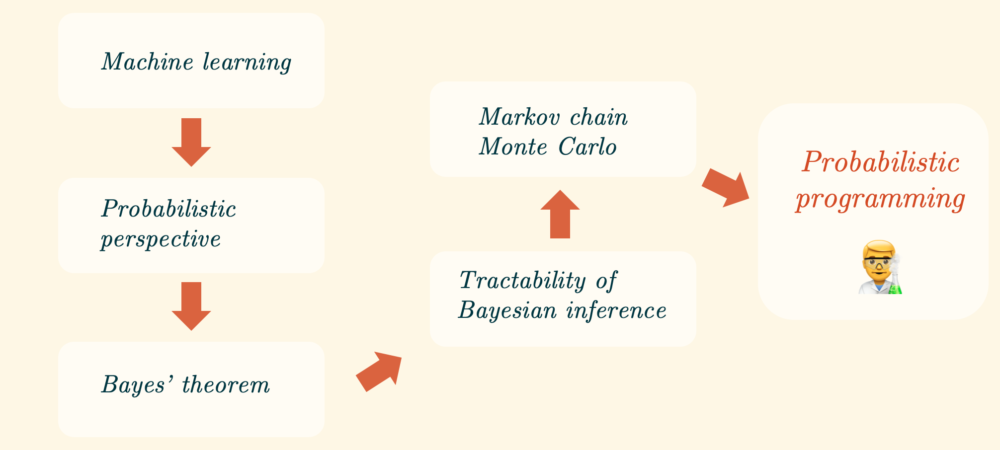

# Introduction to Probabilistic Programming
Author: Alex Chan | @[__aybchan__](https://github.com/aybchan)



Docker container environment with materials for probabilistic programming workshop

Probabilistic programming is a cutting-edge tool at the heart of the Bayesian revolution in the sciences.

In this workshop, we give an introduction to Bayesian statistics, the probabilistic perspective on machine learning and the probabilistic programming paradigm. This is intended as a technical session for those with an interest in statistics and data science.

A probabilistic perspective towards machine learning allows for the principled representation and manipulation of uncertainty in models and predictions, and for probabilistic inference. The explicit quantification of uncertainty is properly understood as the logic of science; learning from data in a stochastic world can be done on such terms.

## Slides
`presentation/slides.pdf`

## References
### Textbooks

- Machine Learning: A Probabilistic Perspective—Kevin P. Murphy. MIT Press (2012)
- Pattern Recognition and Machine Learning—Christopher Bishop. Springer (2006)
- Information Theory, Inference and Learning Algorithms—David J.C. Mackay. Cambridge University Press (2012)
- Probabilistic Graphical Models—Daphne Koller. MIT Press (2009)
- Probability Theory: The Logic of Science—E.T. Jaynes. Cambridge University Press (2003)

### Papers
- MCMC using Hamiltonian dynamics—R. M. Neal (2010)
- A Conceptual Introduction to Hamiltonian Monte Carlo—M. Betancourt (2017)
- Probabilistic programming in Python using PyMC3—Salvatier, J., Wiecki​ T.V., Fonnesbeck C. (2016)
- Forecasting at Scale—Taylor, S.J., Letham, B. (2017)
- Are our brains Bayesian?—Robert Bain (2016)

### Videos
- [Probabilistic Machine Learning - Prof. Zoubin Ghahramani](https://www.youtube.com/watch?v=095Ee0rKC14)
- [Iain Murray: "Introduction to MCMC for Deep Learning"](https://www.youtube.com/watch?v=Em6mQQy4wYA)
- [Machine learning - Importance sampling and MCMC I](https://www.youtube.com/watch?v=TNZk8lo4e-Q)
- [Deep Probabilistic Modelling with Gaussian Processes - Neil D. Lawrence - NIPS Tutorial 2017](https://www.youtube.com/watch?v=NHTGY8VCinY)
- [Austin Rochford | Variational Inference in Python](https://www.youtube.com/watch?v=3KGZDC3-_iY)
- [Deep Probabilistic Methods with PyTorch - Chris Ormandy](https://www.youtube.com/watch?v=HNKlytVD1Zg)
- [PROBPROG Conference](https://www.youtube.com/channel/UCTFDb7aQY1ewBYwJJrpKp6Q)

## Agenda

Time: 2h 30m
- The probabilistic perspective
- Challenges in Bayesian inference
- Markov chain Monte Carlo
- Probabilistic programming in PyMC3
- Time series modelling with PyMC3
- Probabilistic deep learning


## Prerequisites
- `git`
- `Docker`

## Instructions
Works on Mac and Linux machines, untested on Windows.

```
git clone https://github.com/solarwinds/probprog-workshop.git
cd probprog-workshop
docker build -t probabilistic_programming docker
docker run --mount src=`pwd`/notebooks,target=/workspace/notebooks,type=bind -p 8888:8888 -it probabilistic_programming
```
Open `localhost:8888` in your browser

Once you have finished, you may want to delete the Docker image:

```
docker rmi probabilistic_programming
```

## Demo links
### Gaussian process
Interactive demo: https://gaussianprocess.herokuapp.com/

Code: https://github.com/aybchan/gaussianprocess

### Markov chain
[Markov chain simulation](http://setosa.io/markov)

[3-state Markov chain simulation](http://setosa.io/markov/index.html#%7B%22tm%22%3A%5B%5B0.1%2C0.1%2C0.8%5D%2C%5B0.5%2C0.3%2C0.2%5D%2C%5B0.7%2C0.1%2C0.2%5D%5D%7D)

### Markov chain Monte Carlo
[Metropolis-Hastings on a banana](https://chi-feng.github.io/mcmc-demo/app.html?algorithm=RandomWalkMH&target=banana): Vanilla MCMC demo

[Metropolis-Hastings on a multimodal distribution](https://chi-feng.github.io/mcmc-demo/app.html?algorithm=RandomWalkMH&target=multimodal): Lower proposal σ to demonstrate convergence problem

[Hamiltonian Monte Carlo on a multimodal distribution](https://chi-feng.github.io/mcmc-demo/app.html?algorithm=HamiltonianMC&target=multimodal): Using gradient information for proposing next samples instead of a Gaussian centred at the current sample leads to faster convergence


## nbviewer
If you can't/don't want to build the `docker` image, you can use `nbviewer` to follow the notebooks:

#### [Notebook 1: Coin flipping](https://nbviewer.jupyter.org/github/solarwinds/probprog-workshop/blob/master/notebooks/solutions/S1_bayesian_coin_flip.ipynb)

#### [Notebook 2: Markov chains and their stationary distributions](https://nbviewer.jupyter.org/github/solarwinds/probprog-workshop/blob/master/notebooks/solutions/S2_markov_chains.ipynb)

#### [Notebook 5: PyMC3: Bayesian coin flipping](https://nbviewer.jupyter.org/github/solarwinds/probprog-workshop/blob/master/notebooks/solutions/S5_pymc3_coin_flip.ipynb)

#### [Notebook 6: PyMC3: Bayesian changepoint detection](https://nbviewer.jupyter.org/github/solarwinds/probprog-workshop/blob/master/notebooks/solutions/S6_pymc3_changepoint.ipynb)

#### [Notebook 7: PyMC3: Bayesian time series analysis](https://nbviewer.jupyter.org/github/solarwinds/probprog-workshop/blob/master/notebooks/solutions/S7_pymc3_time_series.ipynb)


